# 📈 Forex Market Risk Analysis Dashboard


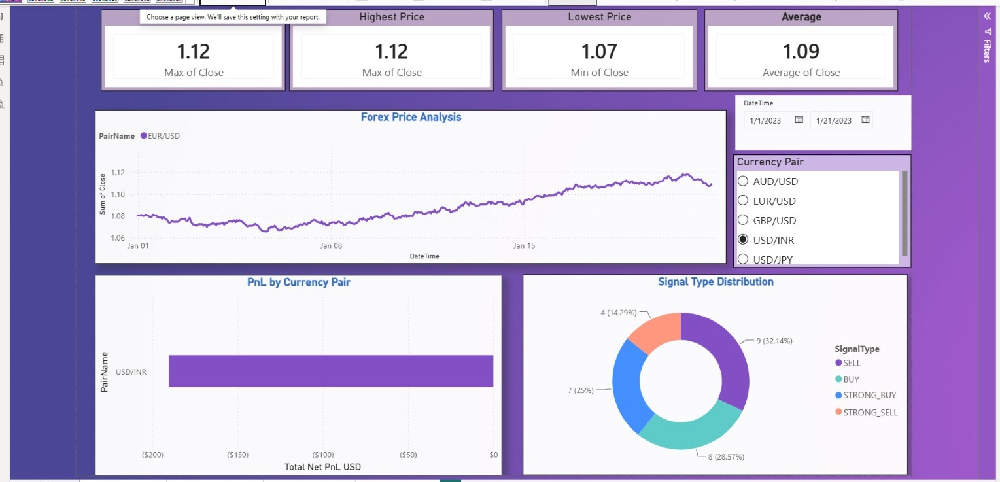

An end-to-end financial data analytics project developed using **Python** and **Microsoft Power BI**.

This project analyzes historical Forex prices, trading performance, market sessions, trading strategies, portfolio risk, and Monte Carlo simulation results through automated Python analysis and four interactive Power BI dashboards.

---

## 📌 Project Overview

The Forex Market Risk Analysis project demonstrates how Python and Microsoft Power BI can be combined to build a complete financial analytics workflow.

Python is used for:

- Data validation and cleaning
- Exploratory Data Analysis
- Trade P&L normalization
- Currency-pair performance analysis
- Trading-strategy evaluation
- Equity-curve and drawdown analysis
- Monte Carlo portfolio-risk simulation
- Automated report and chart generation

Microsoft Power BI is used to create interactive dashboards for:

- Forex Market Analysis
- Monte Carlo Risk Analysis
- Trading Session Analysis
- Trading Strategy Performance

---

## 🎯 Project Objectives

- Analyze historical Forex price movements.
- Validate the quality of source datasets.
- Standardize and normalize trade Profit & Loss.
- Compare performance across currency pairs.
- Evaluate strategy-wise trading results.
- Measure equity growth and portfolio drawdown.
- Analyze performance across global trading sessions.
- Simulate portfolio risk using Monte Carlo scenarios.
- Build an interactive four-page Power BI dashboard.
- Present financial insights through professional visualizations.

---

## 🔄 Analytics Workflow

The project follows a structured four-step Python workflow:

### Step 0 — Source Data EDA

- Source-dataset validation
- Missing-value detection
- Duplicate detection
- Summary-statistics calculation
- Data-quality report generation

### Step 1 — Trade P&L Normalization

- Standardization of trade-level P&L
- Currency-pair aggregation
- Strategy-level aggregation
- Normalized trade-log creation

### Step 2 — Trade Performance Analysis

- Equity-curve calculation
- Running-peak calculation
- Drawdown measurement
- Pair-wise performance analysis
- Strategy-wise performance analysis
- Trade-performance report generation

### Step 3 — Monte Carlo Risk Analysis

- Portfolio P&L distribution analysis
- Risk-metric calculation
- Stress-sensitivity analysis
- Monte Carlo risk-report generation

The complete workflow can be executed using the master `analysis.py` script.

---

## 🛠 Technologies Used

| Technology | Purpose |
|---|---|
| Python | Financial data analysis and automation |
| Pandas | Data cleaning, transformation, and aggregation |
| NumPy | Numerical and statistical calculations |
| Matplotlib | Financial charts and risk visualizations |
| Microsoft Power BI | Interactive dashboard development |
| DAX | KPI measures and business calculations |
| Power Query | Data preparation and transformation |
| CSV | Source-data and analytical-output storage |

---

## 📂 Dataset Information

### 1. Forex Price Data

File: `Data/forex_price_data.csv`

Contains historical Forex market-price information.

Key columns include:

- `DateTime`
- `PairName`
- `Open`
- `High`
- `Low`
- `Close`
- `Volume`

### 2. Monte Carlo Scenario Data

File: `Data/mc_scenarios.csv`

Contains simulated portfolio-risk scenarios.

Key columns include:

- `ScenarioID`
- `PortfolioPnL`
- `VolShock`
- `CorrShock`
- `EURUSD_PnL`
- `GBPUSD_PnL`
- `USDJPY_PnL`

### 3. Trade Log

File: `Data/trade_log.csv`

Contains historical trade-level information.

Key columns include:

- `TradeID`
- `PairName`
- `EntryPrice`
- `ExitPrice`
- `EntryDateTime`
- `ExitDateTime`
- `HoldingDays`
- `PnL`
- `SignalType`
- `StrategyName`

### 4. Time Dimension

A custom Power BI time-dimension table is used for trading-session analysis.

Key fields include:

- `Hour`
- `Session`
- `IsOverlap`
- `TimeKey`

---

## 🐍 Python Analysis

Python automatically generates analytical CSV reports and PNG visualizations inside the `Outputs` folder.

The analysis includes:

- Source-data quality validation
- Forex price-trend analysis
- Trade P&L distribution
- Currency-pair performance comparison
- Strategy-performance comparison
- Equity-curve and drawdown analysis
- Monte Carlo P&L distribution
- Portfolio stress-sensitivity analysis

### Forex Price Trend

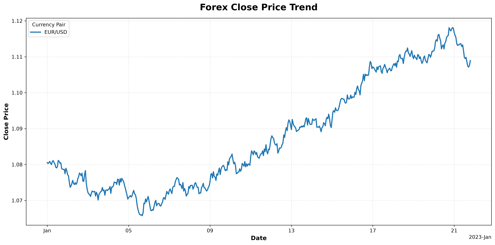

### Trade P&L Distribution

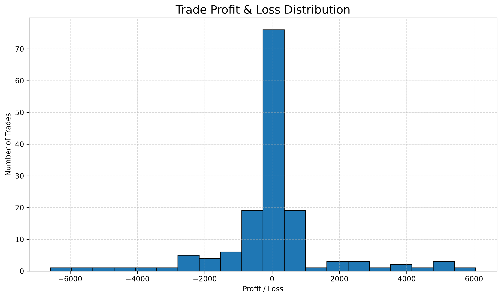

### Currency-Pair Net P&L

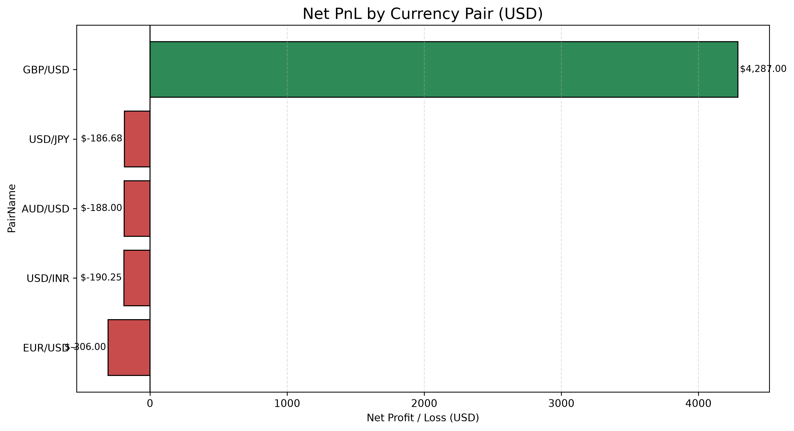

### Strategy Net P&L

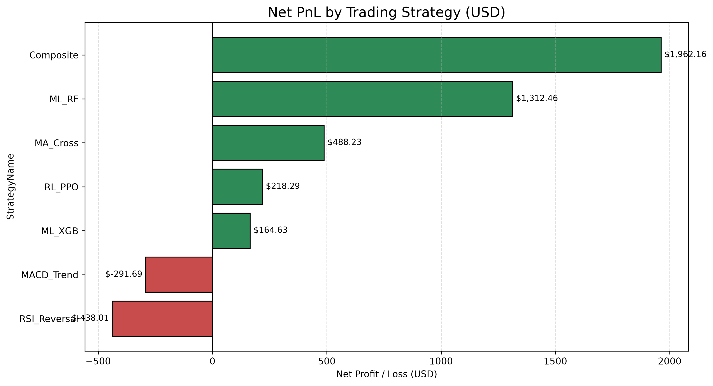

### Equity Curve and Drawdown

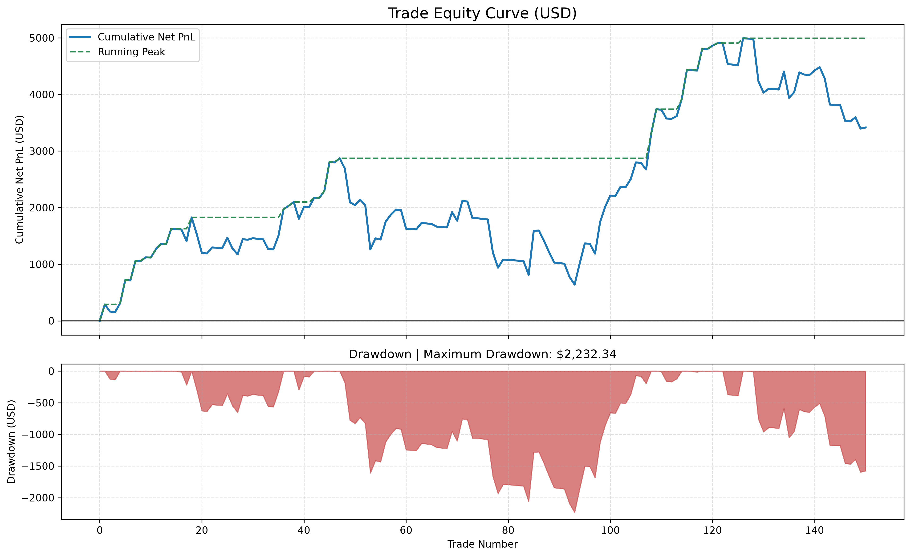

### Monte Carlo P&L Distribution

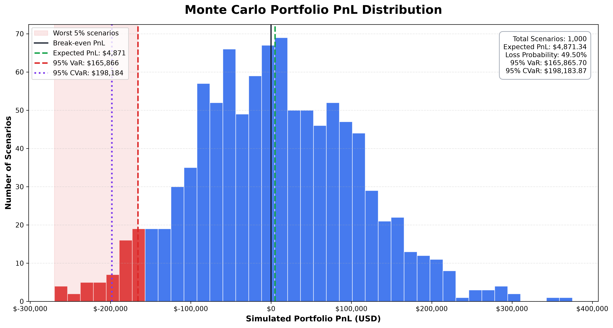

---

## 🧩 Power BI Data Model

The Power BI data model contains the following primary tables:

- `forex_price_data`
- `mc_scenarios`
- `trade_log`
- `DimTime`

The `DimTime` table is connected to the trade data for session-wise and market-overlap analysis.

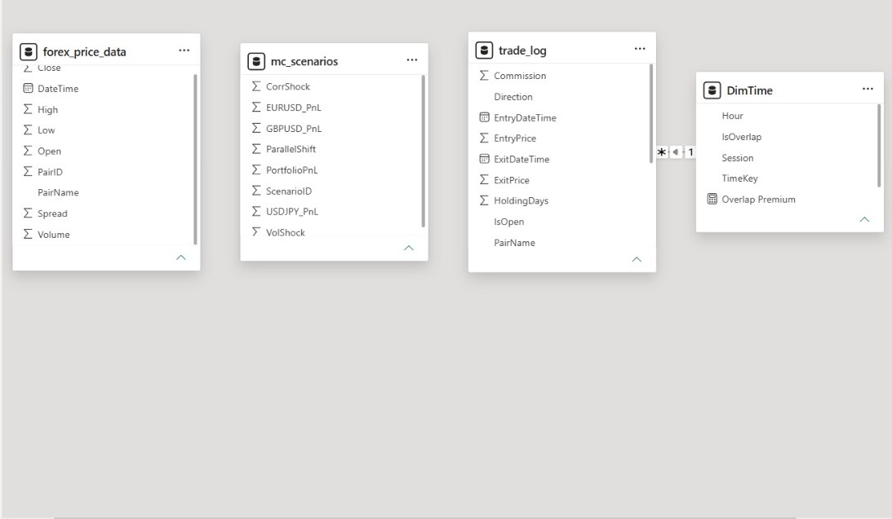

---

## 📊 Power BI Dashboard

The Power BI report contains **four interactive dashboard pages**.

### 📈 Page 1 — Forex Market Analysis

Key features:

- Current Price KPI
- Highest Price KPI
- Lowest Price KPI
- Average Price KPI
- Historical Forex Price Trend
- P&L by Currency Pair
- Trading Signal Distribution
- Currency-Pair Filter
- Date Filter


---

### 📉 Page 2 — Monte Carlo Risk Analysis

Key features:

- Average Portfolio P&L
- Maximum Portfolio P&L
- Minimum Portfolio P&L
- Portfolio Simulation Distribution
- Risk-versus-Return Scatter Plot
- Scenario Range Slider
- Interactive Tooltips

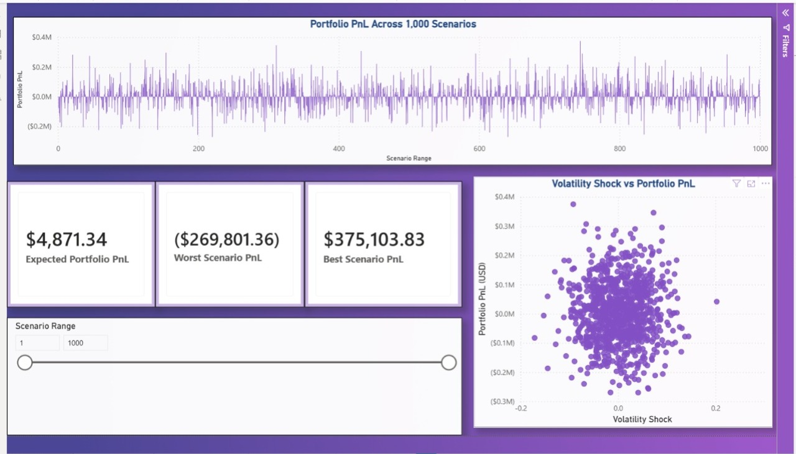

---

### 🌍 Page 3 — Trading Session Analysis

Key features:

- Trading Session Heatmap
- Session-wise Profit & Loss
- Session Performance Comparison
- Market-Overlap Analysis
- Overlap Premium KPI

Trading sessions covered:

- London
- New York
- Tokyo
- Sydney

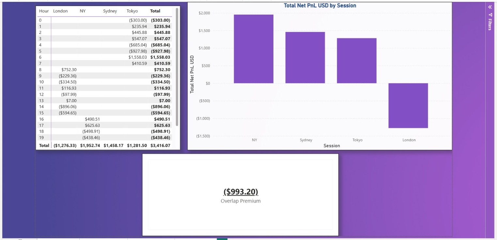

---

### 📊 Page 4 — Strategy Performance Analysis

Key features:

- Strategy-wise Profit & Loss
- Strategy Distribution
- Signal-Type Analysis
- Interactive Signal Filter
- Comparative Strategy Performance

Strategies analyzed include:

- `ML_RF`
- `ML_XGB`
- `MACD_Trend`
- `RSI_Reversal`
- `MA_Cross`
- `RL_PPO`
- `Composite`

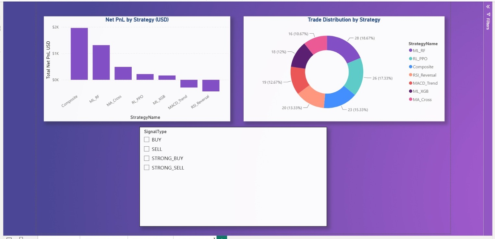

---

## 📈 Key Analytical Insights

- Historical Forex-price behavior was analyzed across multiple currency pairs.
- Trade-level P&L was cleaned, standardized, and aggregated.
- Currency-pair performance was compared using net P&L.
- Multiple algorithmic and technical trading strategies were evaluated.
- Equity-curve and drawdown analysis were used to measure trading risk.
- Global trading sessions were compared to identify performance differences.
- Market-overlap periods were evaluated through an overlap-premium KPI.
- Monte Carlo scenarios were analyzed to estimate portfolio uncertainty.
- Stress sensitivity was evaluated using volatility and correlation shocks.
- Python outputs were integrated with Power BI for financial reporting.

---

## 📁 Project Structure

```text
Project-1C/
│
├── Dashboard/
│   ├── dashboard_page_1_forex.png
│   ├── dashboard_page_2_monte_carlo.png
│   ├── dashboard_page_3_trading_session.png
│   ├── dashboard_page_4_strategy.png
│   └── powerbi_data_model.jpeg
│
├── Data/
│   ├── forex_price_data.csv
│   ├── mc_scenarios.csv
│   └── trade_log.csv
│
├── Outputs/
│   ├── equity_curve_data.csv
│   ├── equity_curve_drawdown.png
│   ├── forex_price_trend.png
│   ├── monte_carlo_pnl_distribution.png
│   ├── monte_carlo_risk_metrics.csv
│   ├── monte_carlo_stress_sensitivity.csv
│   ├── parallel_shift_vs_pnl.png
│   ├── pair_net_pnl_usd.png
│   ├── pair_performance_usd.csv
│   ├── pnl_distribution.png
│   ├── source_data_quality_summary.csv
│   ├── strategy_net_pnl_usd.png
│   ├── strategy_performance_usd.csv
│   ├── trade_log_normalized.csv
│   ├── trade_net_pnl_distribution_usd.png
│   └── trade_performance_summary.csv
│
├── Report/
│   ├── step0_source_data_eda_report.txt
│   ├── step3_monte_carlo_risk_report.txt
│   └── trade_performance_report.txt
│   ├── .gitignore
├── analysis.py
├── step0_source_data_eda.py
├── step1_normalize_trade_pnl.py
├── step2_trade_performance.py
├── step3_monte_carlo_risk.py
├── Project_1C_Dashboard.pbix
├── requirements.txt
└── README.md
```

---

## 🚀 How to Run the Project

### 1. Clone the repository

```bash
git clone <repository-url>
cd Project-1C
```

### 2. Install the required Python libraries

```bash
pip install -r requirements.txt
```

### 3. Run the complete Python analysis

```bash
python analysis.py
```

### 4. Review the generated results

After successful execution:

- Charts and CSV summaries will be available inside `Outputs/`.
- Text-based analytical reports will be available inside `Report/`.

### 5. Open the Power BI Dashboard

Open the following file using Microsoft Power BI Desktop:

```text
Project_1C_Dashboard.pbix
```

---

## 🚀 Future Improvements

- Live Forex API integration
- Real-time market-data refresh
- AI-based Forex price prediction
- Automated portfolio-risk alerts
- Trading-signal recommendation system
- Advanced Value at Risk analysis
- Power BI Service deployment
- Scheduled dashboard refresh
- Broker API integration

---

## 💼 Skills Demonstrated

- Python Programming
- Data Cleaning
- Exploratory Data Analysis
- Financial Data Analytics
- Trade Performance Analysis
- Monte Carlo Simulation
- Portfolio Risk Analysis
- Equity Curve and Drawdown Analysis
- Microsoft Power BI
- DAX
- Power Query
- Data Modeling
- Interactive Dashboard Design
- Business Intelligence
- Data Visualization

---

## ⚠️ Disclaimer

This project was created for educational and analytical purposes only. It does not provide financial or investment advice.

---

## 👨‍💻 Author

**Kishor Degama**

Aspiring Data Analyst

**Skills:** Python · SQL · Power BI · Excel · Data Visualization · Financial Analytics